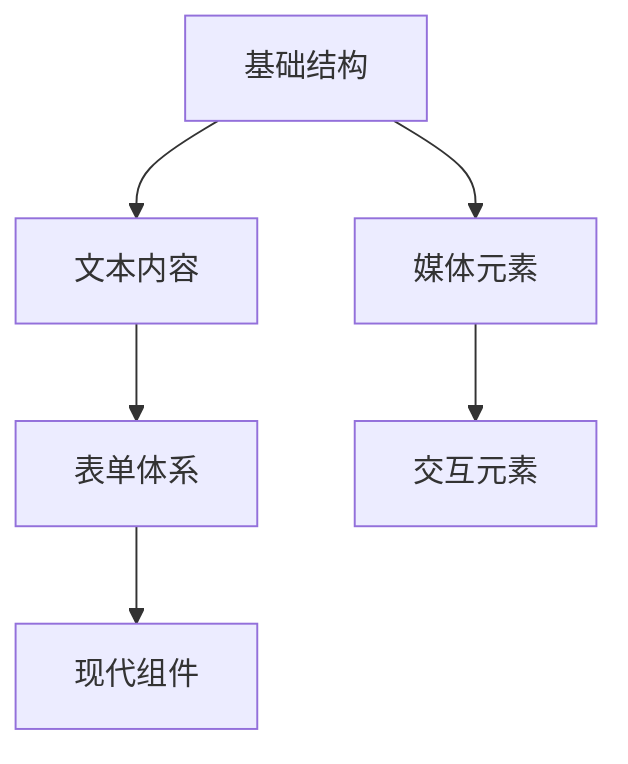

# HTML 元素体系

## 一、基础结构元素

```html
<!-- 文档骨架 -->
<!DOCTYPE html>
<html>
<head>...</head>
<body>...</body>
</html>
```

### 1. 文档元元素

| 元素        | 作用        | 示例                        |
|-----------|-----------|---------------------------|
| `<head>`  | 元数据容器     | 包含 title/meta/link 等      |
| `<title>` | 页面标题      | `<title>文档标题</title>`     |
| `<meta>`  | 文档级元数据    | `<meta charset="UTF-8">`  |
| `<base>`  | 基础 URL 设置 | `<base href="/docs/">`    |
| `<link>`  | 外部资源链接    | `<link rel="stylesheet">` |

### 2. 内容容器

```html
<!-- 分层结构示例 -->
<body>
<header>...</header>
<main>
    <article>...</article>
    <aside>...</aside>
</main>
<footer>...</footer>
</body>
```

## 二、语义化内容元素

### 1. 文本内容

| 元素             | 适用场景   | 语义化替代方案                  |
|----------------|--------|--------------------------|
| `<p>`          | 段落文本   | -                        |
| `<blockquote>` | 块级引用   | 替代 `<div class="quote">` |
| `<pre>`        | 预格式化文本 | 代码/日志展示                  |
| `<code>`       | 内联代码片段 | 替代 `<span class="code">` |

### 2. 列表体系

```html
<!-- 嵌套列表示例 -->
<ul>
    <li>前端技术
        <ol>
            <li>HTML</li>
            <li>CSS</li>
        </ol>
    </li>
</ul>
```

## 三、媒体元素

### 1. 图像元素

```html
<!-- 响应式图片示例 -->
<picture>
    <source media="(min-width: 800px)" srcset="large.jpg">
    
</picture>
```

### 2. 音视频元素

```html

<video controls width="600">
    <source src="video.mp4" type="video/mp4">
    <track label="中文字幕" kind="subtitles" srclang="zh" src="subs.vtt">
</video>
```

## 四、表单元素体系

### 1. 基础表单结构

```html

<form action="/submit" method="post">
    <fieldset>
        <legend>用户信息</legend>
        <label for="name">姓名：</label>
        <input type="text" id="name" name="name" required>
    </fieldset>
</form>
```

### 2. 输入类型大全

| 类型      | 用途     | 示例                     |
|---------|--------|------------------------|
| `email` | 电子邮件输入 | `<input type="email">` |
| `tel`   | 电话号码   | `<input type="tel">`   |
| `range` | 滑块输入   | `<input type="range">` |
| `date`  | 日期选择器  | `<input type="date">`  |
| `color` | 颜色选择器  | `<input type="color">` |

### 3. 表单验证特性

```html
<input
        type="password"
        minlength="8"
        pattern="(?=.*\d)(?=.*[a-z]).{8,}"
        title="必须包含字母和数字，至少8位"
>
```

## 五、交互元素

### 1. 脚本支持元素

```html

<canvas id="myCanvas" width="200" height="100"></canvas>
<script>
    const ctx = document.getElementById('myCanvas').getContext('2d')
    ctx.fillStyle = '#FF0000'
    ctx.fillRect(0, 0, 50, 50)
</script>
```

### 2. 动态内容元素

```html

<details>
    <summary>查看详情</summary>
    <p>隐藏的详细内容...</p>
</details>

<dialog open>
    <p>这是一个模态对话框</p>
</dialog>
```

## 六、现代 Web 组件

### 1. Web Components

```html
<!-- 自定义元素示例 -->
<user-card name="张三" avatar="user.jpg"></user-card>

<script>
    class UserCard extends HTMLElement {
        constructor() {
            super()
            // 组件逻辑
        }
    }

    customElements.define('user-card', UserCard)
</script>
```

### 2. 模板元素

```html

<template id="cardTemplate">
    <div class="card">
        <slot name="title"></slot>
        <slot name="content"></slot>
    </div>
</template>
```

## 七、废弃元素对照表

| 废弃元素        | 替代方案                     | 废弃原因     |
|-------------|--------------------------|----------|
| `<font>`    | CSS 样式                   | 样式与结构混合  |
| `<center>`  | CSS `text-align: center` | 样式属性替代   |
| `<frame>`   | `<iframe>`               | 框架集安全性问题 |
| `<marquee>` | CSS Animation/JS 实现      | 不符合现代标准  |

## 内容组织建议

### 1. 学习路径规划



### 2. 文档规范要求

- 每个元素说明包含：
    1. 标准语法格式
    2. 核心属性说明
    3. 可访问性要求
    4. 浏览器兼容性提示
    5. 典型使用场景示例

### 3. 最佳实践

```html
<!-- 语义化+可访问性示例 -->
<nav aria-label="Main navigation">
    <ul role="menubar">
        <li role="menuitem"><a href="/">Home</a></li>
        <li role="menuitem"><a href="/about">About</a></li>
    </ul>
</nav>
```

此内容结构特点：

1. **分层分类**：从基础到现代组件递进式展开
2. **对比呈现**：新旧元素/替代方案对照
3. **交互示例**：包含可直接运行的代码片段
4. **可视化辅助**：使用 Mermaid 流程图展示学习路径
5. **扩展指导**：包含文档编写规范建议

建议配合 Vitepress 的 `code-group` 组件展示多语言示例，并通过 `::: warning` 容器强调关键注意事项。
