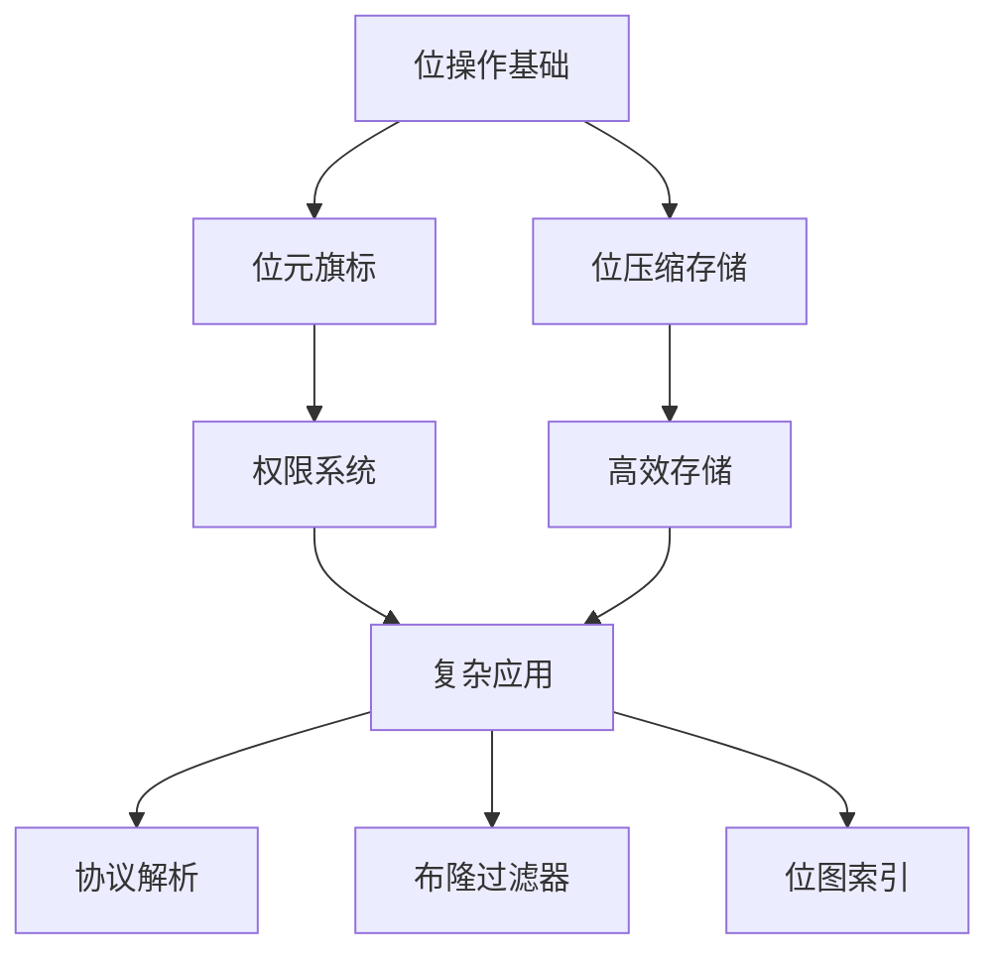

# 位操作艺术

## 一、位运算基础手册

### 1. 基本位运算符

| 运算符   | 名称    | 功能描述           | 示例                      | 二进制结果                                           |
|-------|-------|----------------|-------------------------|-------------------------------------------------|
| `&`   | 按位与   | 两个位都为1时返回1     | `5 & 3` (0b101 & 0b011) | 0b001 (1)                                       |
| `\|`  | 按位或   | 任意位为1时返回1      | `5 \| 3`                | 0b111 (7)                                       |
| `^`   | 按位异或  | 位不同时返回1        | `5 ^ 3`                 | 0b110 (6)                                       |
| `~`   | 按位非   | 反转所有位          | `~0b101`                | 0b11111111111111111111111111111010 (-6)         |
| `<<`  | 左移    | 左移指定位数，右侧补0    | `1 << 3`                | 0b1000 (8)                                      |
| `>>`  | 符号右移  | 保留符号位右移，左侧补符号位 | `-8 >> 1`               | 0b11111111111111111111111111111100 (-4)         |
| `>>>` | 无符号右移 | 右移指定位数，左侧补0    | `-8 >>> 1`              | 0b01111111111111111111111111111100 (2147483644) |

### 2. 实用位运算技巧

```js
// 1. 判断奇偶
const isEven = num => (num & 1) === 0;

// 2. 交换两个数
let a = 5, b = 3;
a ^= b;
b ^= a;
a ^= b; // a=3, b=5

// 3. 取绝对值
const abs = n => (n ^ (n >> 31)) - (n >> 31);

// 4. 判断2的幂
const isPowerOfTwo = n => (n & (n - 1)) === 0;

// 5. 快速乘除
const multiplyBy16 = n => n << 4;
const divideBy8 = n => n >> 3;
```

## 二、位元旗标 (Bitmask Flags)

```js
// 权限控制示例
const PERMISSIONS = {
    READ: 1 << 0,    // 0b0001
    WRITE: 1 << 1,   // 0b0010
    DELETE: 1 << 2   // 0b0100
};

function checkPermission(userPerm, requiredPerm) {
    return (userPerm & requiredPerm) === requiredPerm;
}
```

## 三、位压缩存储

```js
// RGB颜色压缩存储
function packRGB(r, g, b) {
    return (r << 16) | (g << 8) | b;
}

function unpackRGB(packed) {
    const r = (packed >> 16) & 0xFF;
    const g = (packed >> 8) & 0xFF;
    const b = packed & 0xFF;
    return { r, g, b };
}
```


