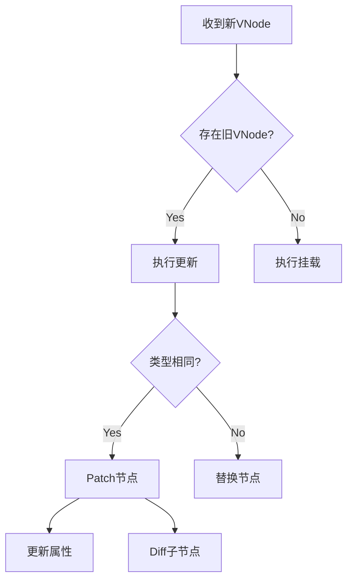

# 虚拟 DOM - Vue3 深度解析

## 一、Diff 算法核心逻辑

### 1.1 Diff 算法设计目标

- **最小化 DOM 操作**：通过对比新旧 VNode 找出最小差异
- **同级比较策略**：只比较同层级节点（时间复杂度 O(n)）
- **快速路径优化**：通过静态标记跳过无需比较的节点

### 1.2 Key 的核心作用

- **节点复用依据**：通过唯一标识判断是否可复用相同类型的节点
- **列表更新优化**：在列表渲染中保持元素状态的关键
- **错误使用后果**：
  - 索引作为 Key 会导致状态错乱
  - 随机 Key 会完全放弃复用机制

### 1.3 同级比对流程

1. **头头比对**：新旧子节点数组头部比较
2. **尾尾比对**：新旧子节点数组尾部比较
3. **最长稳定序列**：寻找最长可复用子序列（贪心算法 + 动态规划）
4. **新增/删除处理**：处理剩余无法复用的节点

### 1.4 优化策略

- **静态提升**：标记静态节点跳过 diff
- **靶向更新**：通过 patchFlag 精准更新特定属性
- **Block Tree**：通过动态节点标记减少遍历范围

---

## 二、渲染函数（h()）与模板编译

### 2.1 h() 函数本质

```typescript
// 函数签名示例
function h(
  type: string | Component,
  props?: object | null,
  children?: Children | Slot | Slots,
): VNode
```

- **虚拟节点工厂函数**：创建 VNode 的描述对象
- **类型支持**：支持组件/HTML元素/Fragment/Portal 等类型
- **自动规范化**：对 children 进行扁平化处理

### 2.2 模板编译过程

```javascript
// 模板代码
<template>
  <div @click="handler">{{ msg }}</div>
</template>

// 编译结果
export function render(_ctx) {
  return h('div', { onClick: _ctx.handler }, _ctx.msg)
}
```

- **编译时优化**：
  - 静态节点提升到外部常量
  - 动态属性标记（patchFlag）
  - 区块树（Block Tree）标记
- **指令转换**：v-if/v-for 转换为条件/循环表达式
- **事件处理**：自动处理事件修饰符和参数包装

### 2.3 两种方式的关联

- **统一中间层**：模板最终编译为渲染函数
- **性能一致性**：编译后的代码与手写 h() 性能相同
- **开发体验差异**：
  - 模板：声明式、受限于 DSL 能力
  - JSX：命令式、完整的 JavaScript 表达能力

---

## 三、Patch 流程解析

### 3.1 核心流程概览



### 3.2 创建节点（Mount）

- **元素类型判断**：
  - HTML 元素：document.createElement()
  - 组件：创建组件实例
  - Fragment：创建文档片段
- **属性处理**：
  - 特殊属性处理（key/ref）
  - DOM 属性 vs Attributes 的正确设置
  - 事件监听器包装（withModifiers）

### 3.3 更新节点（Patch）

1. **属性更新**：

- class/style 的特殊处理
- 动态属性快速路径（patchFlag & PatchFlags）

2. **子节点更新**：

- 文本节点直接替换
- 数组节点执行 diff 算法

3. **指令更新**：

- v-model 的双向绑定处理
- 自定义指令的生命周期调用

### 3.4 卸载节点（Unmount）

- **递归卸载**：深度优先遍历子节点
- **生命周期触发**：
  - 组件：beforeUnmount/unmounted
  - 指令：beforeUnmount/unmounted
- **引用清理**：
  - DOM 元素移除
  - 事件监听器移除
  - 定时器/全局引用清理

### 3.5 特殊节点处理

- **Fragment**：平铺子节点到父容器
- **Portal**：挂载到指定 DOM 节点
- **Suspense**：异步组件加载状态管理
- **KeepAlive**：组件缓存与生命周期管理

---

## 四、性能优化实践

### 4.1 Diff 优化技巧

- **避免同级不同类元素**：导致完全重新创建
- **合理使用 Key**：稳定且唯一的值
- **减少嵌套层级**：扁平化 DOM 结构

### 4.2 渲染函数最佳实践

- **提取静态部分**：避免重复创建 VNode
- **合理使用闭包**：避免不必要的响应式依赖
- **利用 Slots**：保持组件更新粒度

### 4.3 Patch 阶段陷阱

- **避免在子元素保留引用的同时修改父元素**
- **注意过渡动画的生命周期时序**
- **正确处理异步组件的加载状态**

以上结构可根据具体需求进一步展开到代码实现层面或性能分析层面，每个子项都可以独立成章进行深度解析。
