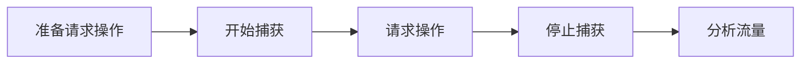

# 抓包

## Wireshark

> Wireshark 是一款强大的网络分析工具，适合各种网络分析和故障排除任务

1. 开源、免费
2. 界面友好，支持中文
3. 强大丰富的筛选规则
4. 支持数百种网络协议
5. 能够捕获网络上的所有流量

### 安装

[下载地址](https://www.wireshark.org/download.html)

- [x] Install USBPcap 1.5.4.0
      (Use Add/Remove Programs first to uninstall any undetected old USBPcap versions)

`USBPcap` 是一个用于捕获 USB 流量的工具，通常与 Wireshark 一起使用。它的主要用途是监控和分析 USB 设备之间的通信，适用于调试 USB 设备或应用程序。_默认不勾选，有需要可以勾选_

### 事前配置

**设置 SSL 文件，解析加密数据**

window 操作系统，打开环境变量设置并新增。**变量名**设置为`SSLKEYLOGFILE`，变量值设置为`D:\sslkeys.log`

回到 Wireshark 软件中。根据下面步骤，编辑 > 首选项 > Protocols > TLS
`(Pre)-Master-Secret log filename` 项目选择会话秘钥文件 `sslkeys.log`

### 开始使用

**捕获流量**

开始捕获分组和停止捕获分组互斥。开始捕获分组会清空历史记录，_可选择保存到磁盘_。

**筛选流量**

快捷键 `ctrl + /` 过滤器。根据规则过滤，只**显示**满足规则的分组
快捷键 `ctrl + F` 查找分组。根据关键词查找并**跳转**到满足规则的分组，多次触发则跳转到下一个

分组列表、分组详情、分组字节流分别对应表格、树状结构、十六进制 + ASCII。
分组详情包含的关键信息更多。在分组详情找到心仪的规则，可以右键选中

|  连接符  |      说明      |
| :------: | :------------: |
|    ==    |  规则完全匹配  |
|    !=    |   规则不匹配   |
| contains | 规则包含关键词 |
|   !()    |    规则取反    |
|   and    |  连接多条规则  |
|    or    |  连接多条规则  |

官方过滤器文档：[筛选项](https://www.wireshark.org/docs/dfref/)

**快速找到目标流量**

- 查找分组详情的字符串"keyword"_（勾选区分大小写）_
  - keyword 设置为 post 请求参数
  - keyword 设置为 请求的某个返回值
- 过滤器设置为 http.request.full_uri contains "keyword"
  - keyword 设置为 get 请求参数
  - 知晓请求的详细信息，keyword 设置 uri 关键词

**查看请求返回数据**

对分组追踪流(_右键菜单选项_)，显示设置为 `UTF-8` ，可正常展示汉字数据

- 滤掉此流。过滤器会增加排除规则，规则能够通过 and 叠加。
- 返回。过滤器恢复原样。
- 关闭。过滤器保持追踪流规则。

## Charles

> Charles 是一款功能强大的 Web 调试代理工具。Charles 支持多种平台，包括 Windows、macOS 和 Linux。

1. 提供直观的 GUI，将相同的地址合并在一起
2. 收费软 ~~但有学习版~~
3. 只能捕获特定端口。数据量不会太多，但是还需要代理转发到捕获端口
4. 不支持中文，也没有人坚持做汉化补丁
5. 支持捕获移动端的流量

### 安装

[下载地址](https://www.charlesproxy.com/download/)

### 事前配置

##

<del>学习版</del>

访问[激活码计算器](https://www.zzzmode.com/mytools/charles)，在唯一的文本框输入随意字符 _Registered Name_，可以生成* License Key*。回到软件 help > Register Charles...。将这组信息输入到对话框即可

> 捕获和解密所有的 HTTPS 请求，无论主机和端口

Proxy > SSL Proxying Settings... > SSL Proxying 标签
include 点击 add 按钮，Host 和 Port 都设置为\* _或者都不填_

> [可选]开启 SOCKS 代理进行网络流量的捕获和转发，移动端可以设置 socks 类型的代理

Proxy > Proxu Settings... > Proxies 标签

- [x] Enable SOCKS proxy

Proxy > Proxu Settings... > Windows 标签

- [x] Use SOCKS proxy

### 电脑抓包

> 电脑安装 Charles 证书。Charles 能够解密和显示通过 SSL/TLS 加密的网络请求和响应

help > SSL proxying > Install Charles Root Certificate

弹出证书安装界面

1. 点击 `安装证书` 按钮
2. 选择存储位置
   1. 当前用户
   2. 本地计算机
3. 选择 `将所有证书放入以下存储`
4. 点击 _浏览_ 按钮
5. 选择 `受信任的根证书颁发机构`
6. 点击 _下一步_ 按钮
7. 点击 _完成_ 按钮

### 移动端抓包

> 手机安装 Charles 证书。Charles 能够解密和显示通过 SSL/TLS 加密的网络请求和响应

help > SSL proxying > Install Charles Root Certificate on a Mobile Device or Remote Browser

1. 参考弹窗说明书进行配置
2. 手机 WLAN 连上与电脑同一网络下的 WIFI
3. 对当前的 WIFI 修改网络。
   1. 代理设置为 `手动`
   2. 服务器主机名 ip 设置为`192.168.xxx.xxx`
   3. 服务器端口 port 设置为 `8888` (_默认值，如果端口冲突可修改_)
4. 浏览器输入*说明书*上的地址 `chls.pro/ssl`，会自动下载证书文件 `charles-proxy-ssl-proxying-certificate.crt`
5. 手机打开设置
   1. 关键词搜索 "证书"
   2. 证书管理应用 > 从存储设备安装
   3. 选择 `CA 证书` 和 `WLAN 证书` 安装

> 用户证书移动到系统证书目录下。(不受信任的用户证书无法对 app 进行抓包)

1. Android 系统需要 root
2. 下载 MT 管理器 app
3. 证书从 <u>/data/misc/user/0/cacerts-added/</u> 移动到 <u>/system/etc/security/cacerts/</u>
