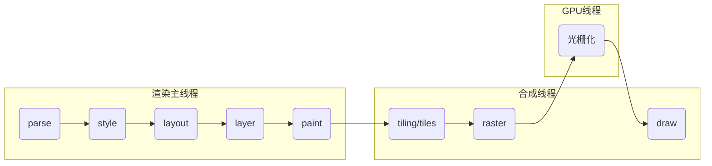
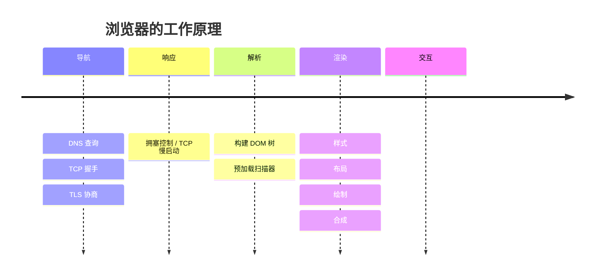

# 首屏加载优化

1. parse 解析 html 文档，字符串转化树形结构
   1. dom 树
   2. css object model 树
2. style 样式计算（全部属性，转化为绝对单位）
   1. 层叠
   2. 继承
   3. 视觉格式化模型
   4. 盒模型
   5. 包含块
3. layout 计算布局树形结构。元素的几何信息和位置信息
4. layer 分层
5. paint
   1. 绘制指令（\<canvas\>）
   2. 分块。页面内容分割成多个小块。避免一次性重绘整个页面
   3. 光栅化。计算出实际像素点
   4. 绘画。transform、filter

- 内容必须在行盒中
- 行盒和块盒不能相邻
