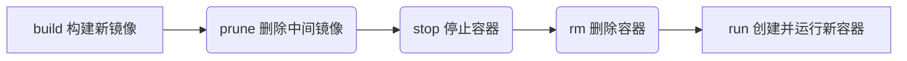

# mysql

## 安装

[mysql 官网连接](https://www.mysql.com/downloads/)

```bash
sudo yum install nodejs npm
```

## 启动 MySQL 服务器

```bash
sudo systemctl start mysqld
# 设置 MySQL 服务器开机自启动
sudo systemctl enable mysqld
```

## 登录

初始无密码，直接回车登录

```bash
mysql -u root -p
```

## 修改密码

```bash
ALTER USER 'root'@'localhost' IDENTIFIED BY 'new_password';
```

## 退出

- 快捷键 Ctrl + D
- 命令行 exit

## 服务器防火墙开发数据库端口

阿里云举例


## 使用 navicat 连接数据库

```bash
  # 创建用户
  create user '新用户名'@'允许的来源ip' identified by '新用户的密码';
  # 查看是否创建成功
  select Host,User from mysql.user;
  # 删除用户
  drop user '用户名'@'ip';
  # 授予权限
  GRANT ALL PRIVILEGES ON *.* TO '用户名'@'ip' WITH GRANT OPTION;
  # 刷新权限
  FLUSH PRIVILEGES;
```

## 创建数据库

```mysql
CREATE DATABASE my_database;
```

## Docker

### 安装

[参考文档](https://help.aliyun.com/zh/ecs/use-cases/deploy-and-use-docker-on-alibaba-cloud-linux-2-instances?spm=5176.ecscore_server.top-nav.8.11344df519zkWv&scm=20140722.S_help%40%40%E6%96%87%E6%A1%A3%40%4051853.S_RQW%40ag0%2BBB2%40ag0%2BBB1%40ag0%2Bhot%2Bos0.ID_51853-RL_docker~DAS~compose-LOC_console~UND~help-OR_ser-V_3-P0_3)

### 配置阿里云国内镜像加速

防止解析元数据失败，读取超时

```bash
vim /etc/docker/daemon.json

# 文件内容
{
"registry-mirrors": ["https://4da6b0g8.mirror.aliyuncs.com"]
}

# 重启 Docker 服务
sudo systemctl restart docker
```

### 运行 nodejs


#### 创建 Dockerfile

```bash
# 使用 Node.js 的官方镜像作为基础镜像
FROM node:14

# 设置工作目录
WORKDIR /app/service/xxx

# 将 package.json 和 package-lock.json 复制到工作目录
COPY package*.json ./

# 安装依赖
RUN npm install

# 将应用程序代码复制到工作目录
COPY . .

# 暴露应用程序的端口（根据你的应用程序配置）
EXPOSE 3000

# 启动应用程序
CMD ["npm", "start"]
```

#### 运行 Docker 容器

```bash
docker build -t nodejs . # 构建 Docker 镜像
docker images # 查看镜像列表
docker run --name nodejs -d -p 4000:80 nodejs # 运行 Docker 容器
```

#### 更新服务



```bash
docker build -t nodejs .

# 删除中间(未使用)镜像
docker image prune

# 停止一个或多个运行中的容器
docker stop nodejs

# 移除一个或多个容器
docker rm nodejs

# 从镜像创建并运行一个新的容器
docker run --name nodejs -d -p 4000:80 nodejs
```

#### 其他关联命令

```bash
# 查看 docker 日志
docker logs nodejs

# 删除 docker 日志(停止容器 -> 删除 -> 启动容器)
rm /var/lib/docker/containers/<container_id>/<container_id>-json.log
```
